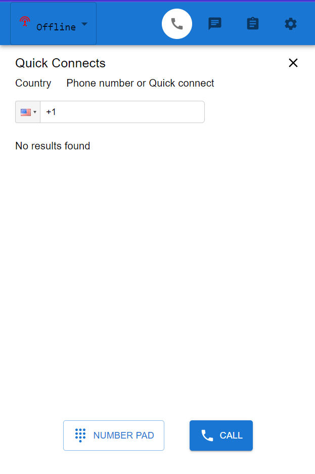

# Customizing CCP Panel using React + TypeScript App

**This repository has customized Amazon Connect CCP Panel.**

**You can use the following code as a seperate component in your own react project.**

> Note: *Refer to package.json file to look at the libraries which are used, react version, typescript version and other information.*

### Components already included:

- CCP Homepage
- Call
- Chat
- on new chat recieve
- Task 
- Create new task
- Navbar as a seperate component
- Numpad page
- Quick Connects page
- Settings

### CCP Code included:

- CCP Initialization (dev-safedent in "us-east-1" region)
- Some connect agent hooks.

### References

- [MUI Icons](https://mui.com/material-ui/material-icons)
- [MUI Styled Components](https://mui.com/material-ui)
- [React Grid Layout](https://github.com/react-grid-layout/react-grid-layout)
- [React date Picker](https://www.npmjs.com/package/react-date-picker)
- [React time picker](https://www.npmjs.com/package/react-time-picker)
- [React time zone picker](https://www.npmjs.com/package/react-timezone-select)

### Screenshots

